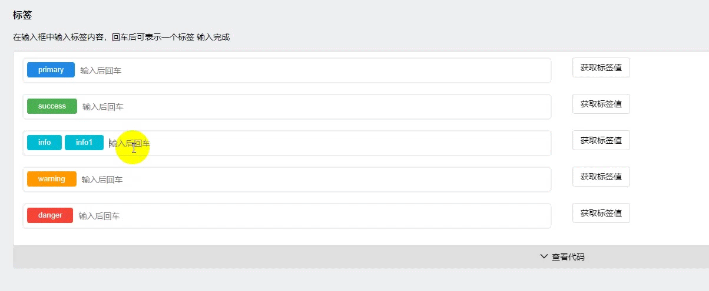

## 页签组件


### 1. 效果图



### 2. 安装

通过npm下载使用
```js
$ npm install @yonyou/ac-input-tags --save-dev
```


### 3. 使用

```js
/**
 *
 * @title 页签
 * @description 应用组件描述
 *
 */

import React, { Component } from 'react';
import { Col, Row, Button, } from 'tinper-bee';
import InputTag from '@yonyou/ac-input-tags';
import '@yonyou/ac-input-tags/dist/index.css';

class Demo1 extends Component {
    constructor(props) {
        super(props);
        this.state = {
            primaryValue: ['primary'],
            successValue: ['success'],
            infoValue: ['info'],
            warningValue: ['warning'],
            dangerValue: ['danger'],
        };

        this.handleClick = this.handleClick.bind(this);
        this.handleChange = this.handleChange.bind(this);
    }

    handleChange(name, values) {
        this.setState({
            [name]: values
        })
    }

    handleClick(name) {
        const string = this.state[name].join();
        alert(string);
    }
    render() {
        const { primaryValue, warningValue, successValue, dangerValue, infoValue } = this.state;
        return (
            <div className="demoPadding">
                <Row>
                    <Col xs={6}>
                        <InputTag id="primary" colors="primary" value={primaryValue} onChange={(values) => this.handleChange('primaryValue', values)} />
                    </Col>
                    <Col xs={6}>
                        <Button shape="border" onClick={() => this.handleClick('primaryValue')}>获取标签值</Button>
                    </Col>
                </Row>
                <Row>
                    <Col xs={6}>
                        <InputTag id="success" colors="success" value={successValue} onChange={(values) => this.handleChange('successValue', values)} />
                    </Col>
                    <Col xs={6}>
                        <Button shape="border" onClick={() => this.handleClick('successValue')}>获取标签值</Button>
                    </Col>
                </Row>
                <Row>
                    <Col xs={6}>
                        <InputTag id="info" colors="info" value={infoValue} onChange={(values) => this.handleChange('infoValue', values)} />
                    </Col>
                    <Col xs={6}>
                        <Button shape="border" onClick={() => this.handleClick('infoValue')}>获取标签值</Button>
                    </Col>
                </Row>
                <Row>
                    <Col xs={6}>
                        <InputTag id="warning" colors="warning" value={warningValue} onChange={(values) => this.handleChange('warningValue', values)} />
                    </Col>
                    <Col xs={6}>
                        <Button shape="border" onClick={() => this.handleClick('warningValue')}>获取标签值</Button>
                    </Col>
                </Row>
                <Row>
                    <Col xs={6}>
                        <InputTag id="danger" colors="danger" value={dangerValue} onChange={(values) => this.handleChange('dangerValue', values)} />
                    </Col>
                    <Col xs={6}>
                        <Button shape="border" onClick={() => this.handleClick('dangerValue')}>获取标签值</Button>
                    </Col>
                </Row>
            </div>
        )
    }
}

export default Demo1;
```
### 4. API

参数 | 类型 | 说明 | 默认值
---|---|---|---
className|String| 类名 | undefined
id|String|input 的 id 值 | undefined
placeholder|String| -- | "输入后回车"
colors|String|标签的颜色，可以选择：'primary'、'success'、'info'、'warning'、'danger'| 'primary'
value|Array| 所有确定输入的标签值 | []
onChange|Function| 每次确定输入或者删除一个标签值的执行, 接收改变后的值 | undefined
